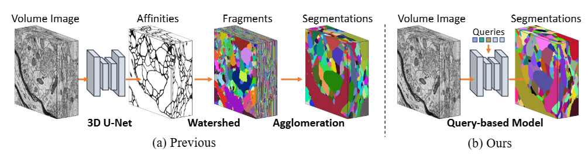

# Efficient Neuron Segmentation in Electron Microscopy by Affinity-Guided Queries (ICLR 2025)

<p align="center">
  
  
  
  <a href="https://openreview.net/pdf?id=Y0QqruhqIa"></a>
  <a href="assets/iclr25_poster.pdf"></a>
</p>

This is the official repository for ["Efficient Neuron Segmentation in Electron Microscopy by Affinity-Guided Queries"](https://openreview.net/pdf?id=Y0QqruhqIa), an ICLR 2025 paper presenting a novel approach for neuron segmentation in electron microscopy images.

## 📖 Introduction


Accurate segmentation of neurons in electron microscopy (EM) images plays a crucial role in understanding the intricate wiring patterns of the brain. Existing automatic neuron segmentation methods rely on traditional clustering algorithms, where affinities are predicted first, and then watershed and post-processing algorithms are applied to yield segmentation results. Due to the nature of watershed algorithm, this paradigm has deficiency in both prediction quality and speed.



Inspired by recent advances in natural image segmentation, we propose to use query-based methods to address the problem because they do not necessitate watershed algorithms. However, we find that directly applying existing query-based methods faces great challenges due to the large memory requirement of the 3D data and considerably different morphology of neurons.

To tackle these challenges, we introduce **affinity-guided queries** and integrate them into a lightweight query-based framework. Specifically:
- We first predict affinities with a lightweight branch, which provides coarse neuron structure information
- The affinities are then used to construct affinity-guided queries, facilitating segmentation with bottom-up cues
- These queries, along with additional learnable queries, interact with the image features to directly predict the final segmentation results

Experiments on benchmark datasets demonstrated that our method achieved better results over state-of-the-art methods with a **2∼3× speedup** in inference.


## 🚀 Quick Start

### Installation

```bash
# Clone the repository
git clone https://github.com/chenhang98/AGQ.git
cd AGQ

# Install dependencies
pip install -r requirements.txt
```

This repository is based on [pytorch_connectomics](https://github.com/zudi-lin/pytorch_connectomics). Please refer to [pytorch_connectomics](https://github.com/zudi-lin/pytorch_connectomics) for more details about the underlying framework.

### Inference and Evaluation

Run inference on the provided test data:

```bash
bash scripts/inference.sh
```

The evaluation results will be printed and the final segmentation results will be saved as an int-type ndarray in `outputs/inference/mask_int_merged.pkl`.

**Expected Output:**
```bash
voi_split: 0.681 | voi_merge: 0.267 | voi_sum: 0.947 | adapted_RAND: 0.089
```

**Pre-trained Model:** The model checkpoint is available at `checkpoints/checkpoint_200000.pth.tar`.

### Training

To train the model from scratch:

```bash
bash scripts/train.sh
```

**Note:** Training requires 8 GPUs by default. Modify `NUM_GPUS` in `scripts/train.sh` according to your hardware setup.

## 📁 Project Structure

```
AGQ/
├── projects/AGQ/           # Main AGQ implementation
│   ├── configs/           # Configuration files
│   ├── model/             # Model architecture
│   ├── loss/              # Loss functions
│   └── main.py            # Training and inference entry point
├── scripts/               # Utility scripts
│   ├── inference.sh       # Inference script
│   ├── train.sh           # Training script
│   ├── inference_mp.py     # Multi-processing inference
│   └── concat_merge_eval.py # Result merging and evaluation
├── datasets/              # Dataset directory
├── outputs/               # Output directory
├── checkpoints/           # Model checkpoints
└── requirements.txt       # Python dependencies
```

## ⚙️ Configuration

The model can be configured through YAML files in `projects/AGQ/configs/`:

- `AGQ.yaml`: Main configuration for AGQ model
- `SNEMI-Base.yaml`: Base configuration for SNEMI3D dataset

Key configuration parameters include:
- `MODEL.ARCHITECTURE`: Model architecture (AGQ)
- `SOLVER.BASE_LR`: Learning rate
- `INFERENCE.INPUT_SIZE`: Input volume size for inference

## 📊 Performance

Our method achieves state-of-the-art performance on benchmark datasets:

| Metric | AGQ | PEA |
|--------|-----|---------------|
| VOI Split | 0.681 | 0.852 |
| VOI Merge | 0.267 | 0.232 |
| VOI Sum | 0.947 | 1.084 |
| Adapted RAND | 0.089 | 0.094 |
| Inference Speed | 2-3× faster | Baseline |

## 🤝 Contributing

We welcome contributions! Please see our [CONTRIBUTING.md](CONTRIBUTING.md) for guidelines on how to contribute to this project.

## 📄 License

This project is licensed under the MIT License - see the [LICENSE](LICENSE) file for details.

## 🙏 Acknowledgement

We would like to thank [pytorch_connectomics](https://github.com/zudi-lin/pytorch_connectomics) for providing the codebase that this project is built upon.

## 📚 Citation

If you find this project useful in your research, please consider citing:

```bibtex
@inproceedings{AGQ,
  author       = {Hang Chen and
                  Chufeng Tang and
                  Xiao Li and
                  Xiaolin Hu},
  title        = {Efficient Neuron Segmentation in Electron Microscopy by Affinity-Guided
                  Queries},
  booktitle    = {The Thirteenth International Conference on Learning Representations,
                  {ICLR}},
  year         = {2025}
}
```

## 📞 Contact

For questions and discussions about this work, please open an issue on GitHub or contact the authors.